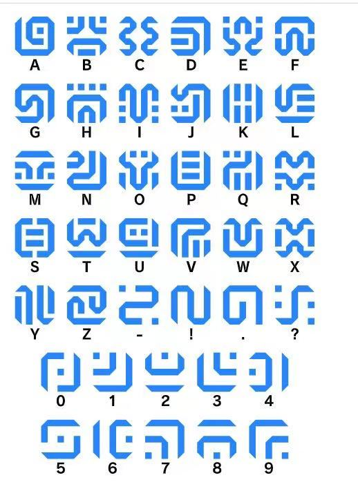

# 塞尔达游戏希卡文字转换器

一图胜前言，实现英文至塞尔达席卡族文字转换与生成的图片解析。

工具地址在这：https://kinglisky.github.io/zelda-words/

github.io 如果打不开戳这里：http://nlush.com/zelda-words/

桌面端效果比较好，移动端没测过~
## 英文 -> 希卡文字映射
- 映射规则
- 前端出图
- 隐藏图片信息
    - 通道最低变换量
    - 不可见水印
    - 傅里叶变化
## 希卡文 -> 英文字映射

- 相似图片识别

## 链接资料
- https://3type.cn/3typezine/typebites/01.html
- https://www.dcode.fr/sheikah-language
- https://zelda.gamepedia.com/Sheikah_Language_Translations
- https://www.chikyukotobamura.org/muse/wr_fiction_3.html
- https://fontstruct.com/fontstructions/show/1371125/sheikah-complete
- https://sspai.com/post/65081

100, 200
01100100,11001000