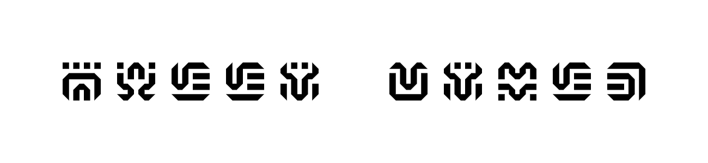
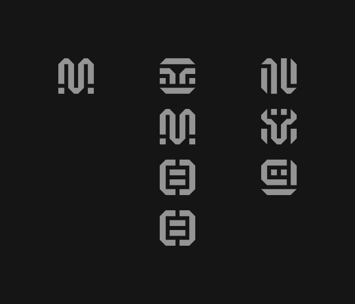
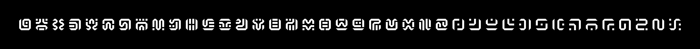

## 希卡文


塞尔达玩家一定不会陌生，希卡文是游戏《塞尔达传说旷野之息》中一种虚构的文字，在希卡族的建筑上都能找到它的影子，之前实现了一个简单的[希卡文生成与翻译的工具](http://nlush.com/zelda-words)，不过关键的文字解析实现的并不优雅，使用隐藏水印的方式将一些关键信息隐藏在导出的图片中，图片压缩后隐藏信息很容易丢失，导致解析失败。有兴趣的同学不妨看看上一篇文章：[摸一个塞尔达希卡文字转换器](https://juejin.cn/post/6935836863844319239)。


后面研究了下 [OCR](https://zh.wikipedia.org/wiki/%E5%85%89%E5%AD%A6%E5%AD%97%E7%AC%A6%E8%AF%86%E5%88%AB) 的技术实现，手撸了个简单版的希卡文字 OCR 解析器，简单扯扯实现，水平有限望指点蛤~

> 光学字符识别（英語：Optical Character Recognition，OCR）是指对文本资料的图像文件进行分析识别处理，获取文字及版面信息的过程。

工具地址在这：
- 工具的演示地址在这：[https://kinglisky.github.io/zelda-words](https://kinglisky.github.io/zelda-words)
- 打不开的同学戳这里：[http://nlush.com/zelda-words/](http://nlush.com/zelda-words/)
- 仓库地址：[https://github.com/kinglisky/zelda-words](https://github.com/kinglisky/zelda-words)

虚构世界的文字往往是基于现实文字创造的，希卡文与英文字母数字与四个特殊符号（共 40 个字符）相对应，规则很简单，都在下图：


我们导出的希卡文图片长这样：




开始吧~

## 图片二值化

我们导出希卡文的图片颜色和文字排列都是不确定的，我们首先需要将图片做一个归一化处理，因为我们只关心图片的文字内容，所以首先要剔除颜色的干扰，我们可以将图片统一处理黑白色调的图片。

这个过程称作[二值化
](https://zh.wikipedia.org/zh-hans/%E4%BA%8C%E5%80%BC%E5%8C%96)，二值化后的图片更能摒除干扰**突出图片的内容特征**，二值化后的图片可以很方便的被序列化生成图片指纹。

> 二值化（英语：Binarization）是图像分割的一种最简单的方法。二值化可以把灰度图像转换成二值图像。把大于某个临界灰度值的像素灰度设为灰度極大值，把小于这个值的像素灰度设为灰度極小值，从而实现二值化。


图片二值化主要流程如下：
- 图片灰度处理
- 计算灰度图片的二值化阈值
- 图片二值化

### 图片灰度处理


我们以上面的图片为例，图片的灰度处理比较简单，将 rgb 通道的颜色按 `r * 0.299 + g * 0.587 + b * 0.114` 的比值相加就能得到灰度值，因为灰度图片的 rgb 通道的值都是相同的，我们只取一个通道的数据用于下一步计算。

```JavaScript
const canvasToGray = (canvas) => {
    const ctx = canvas.getContext('2d');
    const data = ctx.getImageData(0, 0, canvas.width, canvas.height);
    const calculateGray = (r, g, b) => parseInt(r * 0.299 + g * 0.587 + b * 0.114);
    const grayData = [];
    for (let x = 0; x < data.width; x++) {
        for (let y = 0; y < data.height; y++) {
            const idx = (x + y * data.width) * 4;
            const r = data.data[idx + 0];
            const g = data.data[idx + 1];
            const b = data.data[idx + 2];
            const gray = calculateGray(r, g, b);
            grayData.push(gray);
        }
    }
    return grayData;
};
```

灰度处理后的图片如下：


### 二值化阈值

阈值计算是图片二值化非常关键的一步，相关的算法也很多这里，这里我们先试试一种最简单的[均值哈希（aHash）](https://baike.baidu.com/item/%E5%9D%87%E5%80%BC%E5%93%88%E5%B8%8C%E7%AE%97%E6%B3%95)算法，算法很简单，求图片灰度像素的总和再除以像素点数量得出均值作为二值化的阈值。直接上代码：

```JavaScript
const average = (grayData) => {
    let sum = 0;
    for (let i = 0; i < grayData.length; i += 1) {
        sum += data[i];
    }
    return sum / grayData.length;
};
```

其他计算阈值的算法还有：
- [感知哈希 pHash](https://baike.baidu.com/item/%E6%84%9F%E7%9F%A5%E5%93%88%E5%B8%8C%E7%AE%97%E6%B3%95)
- [大津算法 otsu](https://zh.wikipedia.org/wiki/%E5%A4%A7%E6%B4%A5%E7%AE%97%E6%B3%95)

感兴趣的同学可以了解下，otsu 的生成的二值化效果比较好，后面我们会有 otsu 来处理计算图片阈值，这里也贴一个 otsu 的实现：

```JavaScript
const otsu = (grayData) => {
    let ptr = 0;
    // 记录0-256每个灰度值的数量，初始值为 0
    let histData = Array(256).fill(0);
    let total = grayData.length;

    while (ptr < total) {
        let h = grayData[ptr++];
        histData[h]++;
    }
    // 总数(灰度值x数量)
    let sum = 0;
    for (let i = 0; i < 256; i++) {
        sum += i * histData[i];
    }
    // 背景（小于阈值）的数量
    let wB = 0;
    // 前景（大于阈值）的数量 
    let wF = 0;
    // 背景图像（灰度x数量）总和
    let sumB = 0;
    // 存储最大类间方差值
    let varMax = 0;
    // 阈值
    let threshold = 0;

    for (let t = 0; t < 256; t++) {
        // 背景（小于阈值）的数量累加
        wB += histData[t];
        if (wB === 0) continue;
        // 前景（大于阈值）的数量累加
        wF = total - wB;
        if (wF === 0) break;
        // 背景（灰度x数量）累加
        sumB += t * histData[t];

        // 背景（小于阈值）的平均灰度
        let mB = sumB / wB;
        // 前景（大于阈值）的平均灰度
        let mF = (sum - sumB) / wF;
        // 类间方差
        let varBetween = wB * wF * (mB - mF) ** 2;

        if (varBetween > varMax) {
            varMax = varBetween;
            threshold = t;
        }
    }

    return threshold;
};
```

### 图片二值化

求得了阈值后我们再进行二值化就很简单了，不过这里有注意点，由于我们生成的图片**文字颜色和背景颜色**都是不确定的，我们求得阈值后，进行二值化时图片的背景颜色可能大于阈值，也有可能小于阈值，这样就没法统一所有图片的输出。这里我们需要规定二值化的图片输出，我们统一将背景的颜色设置为黑色（数值为 0），文字颜色设置为（255 白色）。

由于我们生成的图片比较简单，图片的背景颜色取第一个像素的 rgb 值就能确认了，代码实现也很简单：

```JavaScript
const binaryzationOutput = (originCanvas, threshold) => {
    const ctx = originCanvas.getContext('2d');
    const imageData = ctx.getImageData(0, 0, originCanvas.width, originCanvas.height);
    const { width, height, data } = imageData;
    // 第一像素的值即为背景色值
    const head = (data[0] + data[1] + data[2]) / 3;
    // 如果背景颜色大于阈值，则背景与文字的颜色的值则需要调换
    const color = head > threshold
        ? { foreground: 0, background: 255 }
        : { foreground: 255, background: 0 };
    for (let x = 0; x < width; x++) {
        for (let y = 0; y < height; y++) {
            const idx = (x + y * width) * 4;
            const avg = (data[idx] + data[idx + 1] + data[idx + 2]) / 3;
            const v = avg > threshold ? color.foreground : color.background;
            data[idx] = v;
            data[idx + 1] = v;
            data[idx + 2] = v;
            data[idx + 3] = 255;
        }
    }
    ctx.putImageData(imageData, 0, 0);
    return originCanvas.toDataURL();
}
```

还有一点需要注意下，这里二值处理的是**原图**，不是灰度处理后的图片。

[完整的代码戳这](https://github.com/kinglisky/zelda-words/blob/master/binarization.js)，二值化的图片如下：


## 文字切割

经过上面的二值化处理我们已经将图片统一处理成黑底白字的图片，操作也特别简单，但生产级别的 OCR 实现往往还会涉及复杂的图片预处理，如图片的投影矫正、旋转矫正、裁剪、图片降噪、锐化等操作，这些预处理都是为了生成一张只包含文字信息的干净图片，因为会很大程度的影响下一步的文字切割。

同字面描述一样，我们得想办法把一个个希卡文字提取出来，下面介绍一种简单的切割算法：**投影的切割算法**。

基本思路是：
- 从上到下扫描图片每一行像素值，切割出文字所在的行
- 从左到右扫描文字行每一列像素值，切割出单个文字

贴一张图片好理解一点，先来切割行：


我们图片大小是 700 x 600，从上至下扫描每一行的像素，黑色像素记为 0 白色像素记为 1，统计每行 1 的个数，我们可以得到下面折线图：


横坐标对应图片的高度，纵坐标对应每行像素点的个数，我们可以很直观知道纵坐标为 0 的部分都是空白，不为 0 的部分则是文字内容所在的行，行高则是所跨越的区间。

## 相似图片检测

经过上面的二值化处理我们已经将图片统一处理成了黑底白字的图片，那我们思考一个问题，对于希卡文我们知道它与英文的映射规则，每个希卡符号背后对都对应一个英文符号，我们可以生成 40 个英文字符对应的希卡符号图片，那么希卡图片翻译就可以简单理解为：将希卡图片拆分一个个符号图片，将拆分的符号与已知的 40 希卡符号图片逐个进行**相似性比较**，相似度最高的图片就是目标字符。



上面为 `abcdefghijklmnopqrstuvwxyz0123456789.-!?` 对应的希卡符号。


我们该如何进行比较两张图片的相似性呢？其实我们已经完成了很大一部分工作，就差临门一脚了。既然一张已经二值化处理成了黑白图片，我们将图片的**黑色像素输出为 0 白色部分输出为 1 **这样就可以得到一张图片的二进制哈希，至于两张图片的相似性就是比较两张图片哈希同一位置的**差异个数**，其实就是计算两张图片的哈希的[汉明距离](https://zh.wikipedia.org/zh-hans/%E6%B1%89%E6%98%8E%E8%B7%9D%E7%A6%BB)，汉明距离越小，两张图片越相似。我们只需要简单改变下二值化输出的代码就能得到图片的哈希。

```JavaScript
const binaryzationHash = (originCanvas, threshold) => {
    const ctx = originCanvas.getContext('2d');
    const imageData = ctx.getImageData(0, 0, originCanvas.width, originCanvas.height);
    const { width, height, data } = imageData;
    // 第一像素的值即为背景色值
    const head = (data[0] + data[1] + data[2]) / 3;
    // 如果背景颜色大于阈值，则背景与文字的颜色的值则需要调换
    const color = head > threshold
        ? { foreground: 0, background: 255 }
        : { foreground: 255, background: 0 };
    const hash = [];
    for (let x = 0; x < width; x++) {
        for (let y = 0; y < height; y++) {
            const idx = (x + y * width) * 4;
            const avg = (data[idx] + data[idx + 1] + data[idx + 2]) / 3;
            const v = avg > threshold ? color.foreground : color.background;
            hash.push(v ? 1 : 0);
        }
    }
    return hash;
}
```

汉明距离的比较也十分简单：

```JavaScript
const hammingDistance = (hash1, hash2) => {
    let count = 0;
    hash1.forEach((it, index) => {
        count += it ^ hash2[index];
    });
    return count;
};
```

这就是相似图片比较最核心的代码了，但在实际操作中，我们一般会将比较的图片都缩小成 8 x 8 大小，这样只需要生成的图片哈希长度只有 64 可以大大提升程序的执行速度。相似图片主要流程如下：
- 将比较的图片都缩小成 8 x 8
- 图片灰度化处理
- 计算二值化阈值
- 图片二值化计算图片哈希
- 比较两张图片哈希的汉明距离

之前详细整理过一篇相似图片识别的文章，对此感兴趣的同学可以看看这篇文章：[相似图片识别的朴素实现](https://juejin.cn/post/6926181310868226061)，我们接着往下。
## 图片文字拆分
